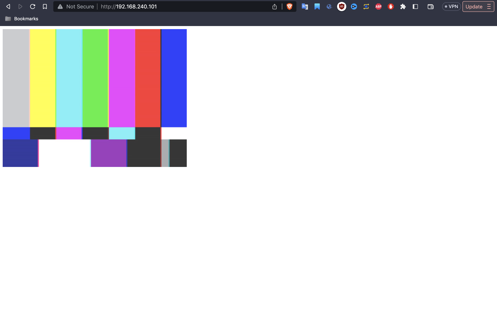
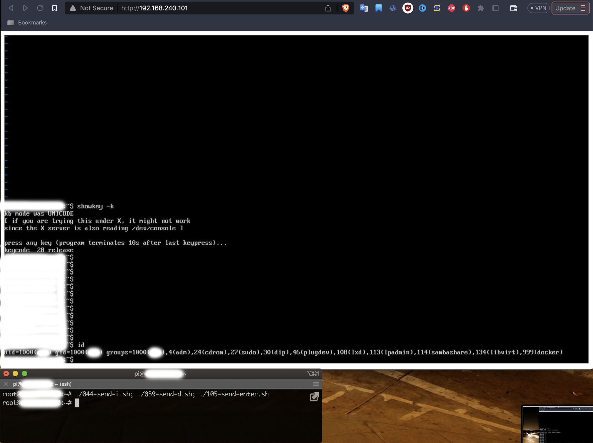
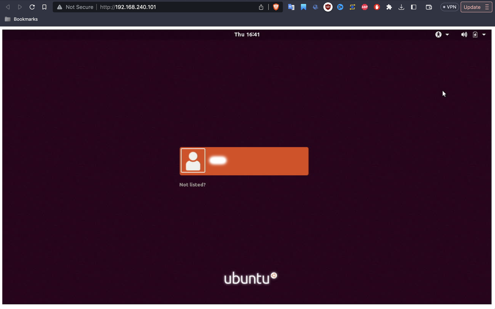
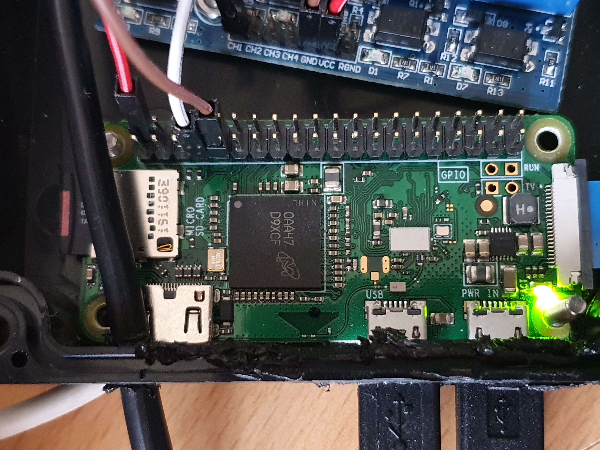
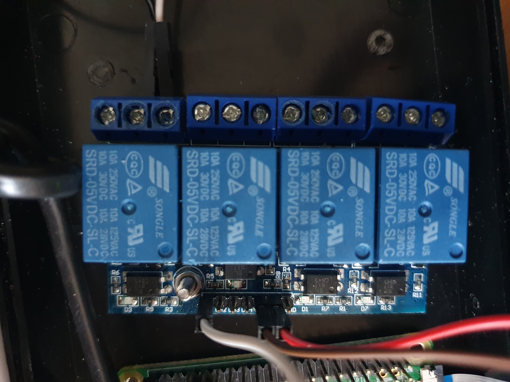
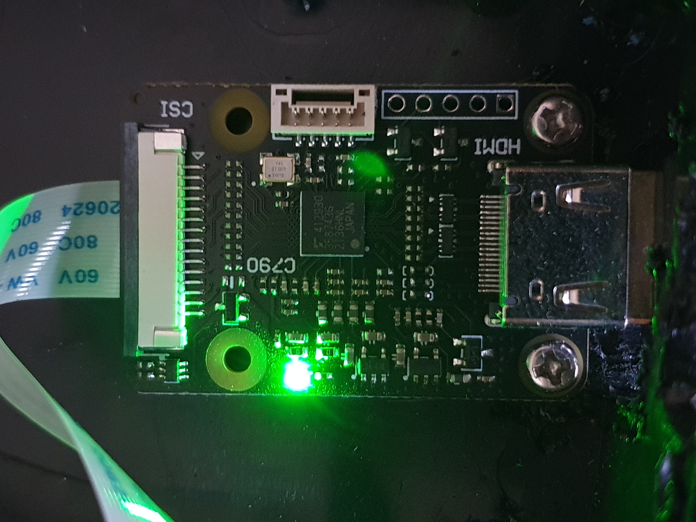

# eraNET Remote

Device that allows to watch and control another computer over the network. It acts as remote monitor, keyboard and mouse. The project was redesigned three times during years to reduce complexity so now it is most simplest version of it which does the job.

## Prerequisites

### Equipment

* Pi Zero W and its Micro USB charging cable

* Geekworm or Waveshare HDMI to CSI Adaptor CSI-2 C790 (they all should have a chip TC358743XBG or shorter name is TC358743)

* 4 Channel 3.3V/5V 10A Relay Module for Arduino RPi ESP8266 (any relay is fine as long as it keeps circut open during its power outage)

* PortaPow USB power blocker - data only, no charging

* HDMI to HDMI cable

* Micro USB to USB cable (only one cable is enough to cover mouse and keyboard)

* 2 core cable (used from relay to Power SW)

* 4 GB SD card

### Demo







## Installation

### Prepare device physically







Tip: you leave power button wired on your computer as is and connect this device in parallel so both - physical power button and button controlled through relay work well together

### Install Raspberry Pi OS

Raspberry Pi Imager v1.7.3 -> Raspberry Pi OS Lite (32bit) with no desktop 0.4G (tested image was 2023-05-03, but latest available can be tried too)

Don't forget to enable SSH, set WiFi SSID and password to connect your Pi Zero to WiFI, also keyboard layout should be US

### Setup

```
ssh pi@your_raspberry_pi
sudo su -
git clone https://github.com/laimison/eranet-remote.git
cd eranet-remote
```

Now you can run scripts in the order they are placed, they contain more information as you go.

